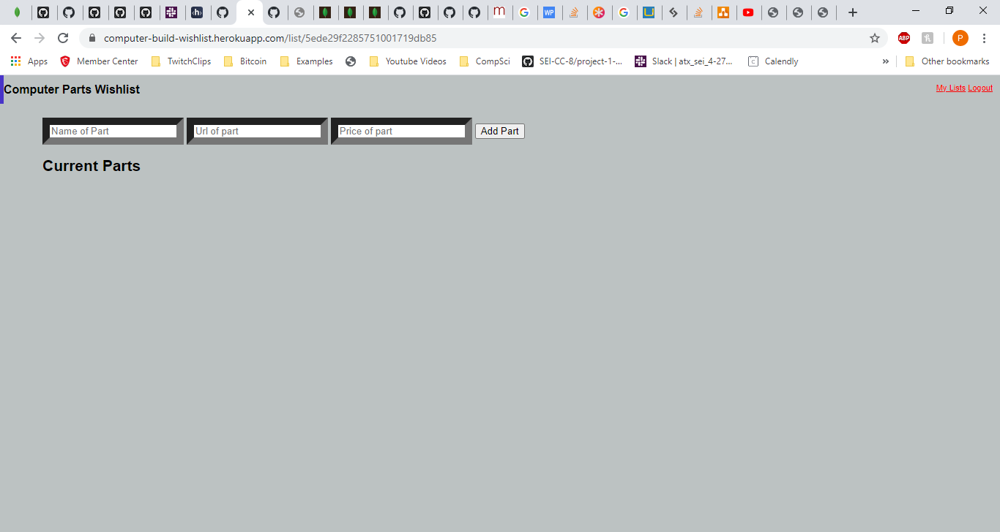

# Computer Parts Wishlist
## 
## Objective:
### - Create a parts list for new computer builds that uses CRUD functionality
## 
## 
## 
## To play the game:
### Click [here](https://computer-build-wishlist.herokuapp.com) to play
## 
## 
### Here is the landing page:

### Here is the Users list of Builds they want

### Here is a Single list of Parts

## Technology Implemented:
- Javascript
- CSS
- HTML
- GIT
- MongoDB
- OAuth
- EJS
- Partials
- MVC
- CRUD

## Here was my Trello board
### [Trello](https://trello.com/b/ROQk8gMX/computer-parts-wish-list)
## 
## 
## 

## Stretch Goals:
- HackerNews articles on the right side of the List of Builds List
- HTML Scraper for the Name, Url, and price of a Part
- Overall better CSS